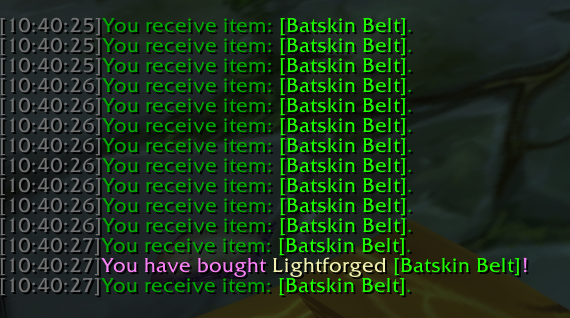
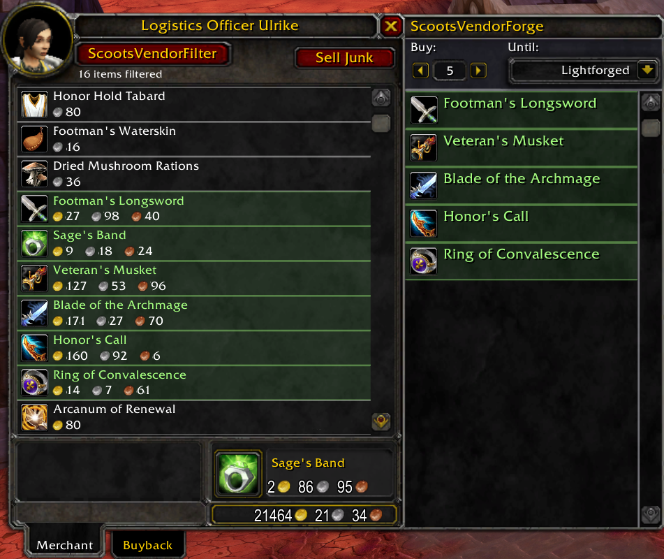

## Description ##

This allows you to automatically purchase and sell an item from a vendor until it reaches the desired forge level or you can no longer afford the item.

## Installation ##

Download this repository, then extract the `ScootsVendorForge` subdirectory from the `src` directory into your `World of Warcraft/Interface/AddOns` directory.

## Screenshots ##

